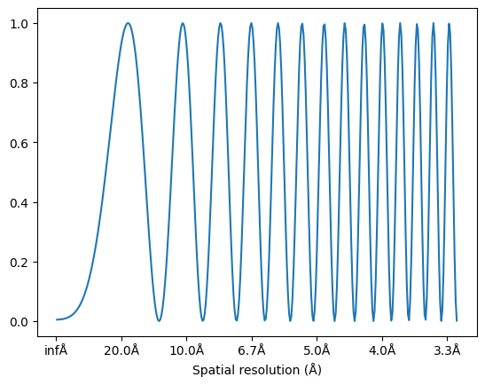

# contrasttransferfunction

[](https://pypi.org/project/contrasttransferfunction)
[](https://pypi.org/project/contrasttransferfunction)

-----

`contrasttransferfunction` is a python library to model and estimate the contrast transfer function for transmission electron microscopy data. The library is designed to:

- Follow CTFFIND conventions and algorithms as much as possible
- Be highly compatible by using pure python, no compiled code
- Stay fast by using numpy vectorization

## Installation

```console
pip install contrasttransferfunction
```

## Examples

### Plot 1D powerspectrum

```python
from contrasttransferfunction import ContrastTransferFunction
import matplotlib.pyplot as plt

myctf = ContrastTransferFunction(
    defocus1_angstroms = 8000,
    pixel_size_angstroms = 2.3
)

plt.plot(myctf.frequency_angstroms_1d, myctf.powerspectrum_1d)
plt.gca().xaxis.set_major_formatter(lambda x, pos: f"{1/x:.1f}Å")
plt.xlabel("Spatial resultion (A)")
```


### Plot 2D powerspectrum

```python
myctf = ContrastTransferFunction(
    defocus1_angstroms = 8000,
    defocus2_angstroms= 6000,
    defocus_angle_degrees=25.3,
    pixel_size_angstroms = 2.3
)
plt.imshow(myctf.powerspectrum_2d,cmap="Greys")
```


## License

`contrasttransferfunction` is distributed under the terms of the [MIT](https://spdx.org/licenses/MIT.html) license.
